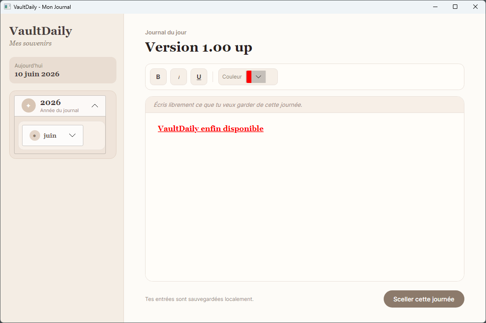

# VaultDaily

VaultDaily est une application de journal personnel développée en C# avec Avalonia.

L'objectif du projet est simple : permettre d'écrire un résumé de sa journée, de garder une trace de ses pensées, de ses progrès, de ses idées et de pouvoir revenir dessus plus tard.

## Genèse du projet

À la base, je voulais créer une application de journal pour faire un récapitulatif de ma journée.

L'idée vient du fait que prendre le temps d'écrire ce que l'on a fait, ce que l'on a appris ou ce que l'on a ressenti peut aider à mieux structurer ses pensées et à améliorer la mémoire. En gardant une trace régulière de ses journées, on peut aussi mieux voir son évolution dans le temps.

Au départ, le projet était donc pensé comme une application simple : sélectionner une date, écrire son journal, sauvegarder, puis pouvoir retrouver ses anciennes entrées.

Ensuite, j'ai découvert Avalonia, un framework qui permet de créer des applications desktop en C# avec une interface graphique moderne. Ce qui m'a intéressé avec Avalonia, c'est la possibilité de développer une application en C# tout en gardant une logique cross-platform, donc potentiellement déployable sur Windows, Linux et macOS.

Au fur et à mesure du développement, le projet est devenu plus intéressant techniquement. Je voulais ajouter un éditeur plus structuré, avec des styles personnalisés, des blocs de texte et une meilleure organisation du contenu. C'est à ce moment-là que j'ai découvert le concept d'AST.

## Qu'est-ce qu'un AST ?

Un AST, ou Abstract Syntax Tree, est un arbre qui permet de représenter une structure de données ou un langage sous forme hiérarchique.

Dans VaultDaily, l'AST sert à donner une structure au contenu écrit dans l'éditeur. Au lieu de manipuler seulement du texte brut, l'application peut découper et organiser le contenu en différents éléments.

Par exemple, une entrée de journal peut contenir :

* un titre
* du texte normal
* des blocs stylisés
* des éléments avec une signification particulière

L'AST permet donc de transformer le texte saisi par l'utilisateur en une structure plus claire et plus facile à analyser, modifier ou afficher.

Ce projet m'a permis d'apprendre un nouveau concept important en programmation : comment passer d'un simple texte à une représentation structurée utilisable par l'application.

## Images

Voici quelques aperçus de l'application VaultDaily.

## Fonctionnalités

VaultDaily permet actuellement de :

* écrire une entrée de journal pour une date précise
* sauvegarder localement les entrées
* consulter l'historique des journaux
* modifier une entrée existante
* utiliser un éditeur avec une coloration et des styles personnalisés
* structurer le contenu grâce à un système basé sur un AST
* naviguer entre les différentes dates disponibles

## Technologies utilisées

Le projet utilise principalement :

* C#
* Avalonia
* .NET
* MVVM
* AST personnalisé
* Sauvegarde locale

## Pourquoi Avalonia ?

Avalonia a été choisi parce qu'il permet de créer des applications desktop en C# avec une approche moderne.

Contrairement à WPF, qui est principalement lié à Windows, Avalonia permet de viser plusieurs plateformes. Cela rend le projet plus flexible et plus intéressant à long terme.

Même si la première version publiée est destinée à Windows, le choix d'Avalonia laisse la possibilité de créer plus tard des versions Linux et macOS.

## Structure du projet

Le projet est organisé autour de plusieurs parties importantes :

* `Models` : contient les modèles de données de l'application
* `ViewModels` : contient la logique liée à l'interface avec l'approche MVVM
* `Views` : contient les fichiers liés à l'interface graphique
* `Services` : contient la logique de sauvegarde et de gestion des données
* `Editor` : contient les éléments liés à l'éditeur personnalisé
* `AST` : contient la logique permettant de construire et manipuler l'arbre de structure du document

Cette organisation permet de séparer la logique métier, l'affichage et la gestion des données.

## Installation

Téléchargez la dernière version depuis l'onglet **Releases** du dépôt GitHub.

Pour Windows :

1. Téléchargez le fichier `VaultDaily-win-x64-v1.0.0.zip`
2. Extrayez l'archive
3. Lancez `VaultDaily.exe`

## Note Windows SmartScreen

Windows peut afficher un avertissement au premier lancement, car l'application n'est pas signée avec un certificat payant.

Ce message ne signifie pas forcément que l'application est dangereuse. Il indique surtout que Windows ne reconnaît pas encore l'application ou son éditeur.

Pour lancer l'application :

1. Cliquez sur `Informations complémentaires`
2. Cliquez sur `Exécuter quand même`

Le code source complet est disponible sur ce dépôt GitHub.

## Plateformes

VaultDaily est développé avec Avalonia, un framework cross-platform.

Pour le moment, seule la version Windows a été testée et publiée.

Des versions Linux et macOS pourront être ajoutées plus tard.

## Objectifs du projet

Ce projet m'a permis de travailler sur plusieurs compétences :

* créer une application desktop complète en C#
* utiliser Avalonia
* organiser un projet avec l'architecture MVVM
* manipuler des fichiers et sauvegarder des données localement
* créer un éditeur personnalisé
* découvrir et implémenter le concept d'AST
* préparer une application pour une publication sur GitHub

## Améliorations possibles

Plusieurs améliorations pourraient être ajoutées dans le futur :

* export des journaux en PDF ou Markdown
* recherche dans les anciennes entrées
* statistiques sur les habitudes d'écriture
* thème clair / sombre
* meilleure gestion des styles dans l'éditeur
* versions Linux et macOS
* système de sauvegarde automatique plus avancé
* chiffrement local des entrées

## Licence

Ce projet est open source.

Vous pouvez consulter, modifier et utiliser le code selon les conditions de la licence présente dans ce dépôt.

## Auteur

Projet développé par Yoann Rivet.

VaultDaily est un projet personnel créé pour apprendre, expérimenter et construire une application utile autour du journal personnel et de la structuration de contenu.

## Contact

Si vous avez des idées pour améliorer VaultDaily, des suggestions de fonctionnalités ou simplement un retour à faire sur l'application, n'hésitez pas à me contacter.

Vous pouvez également ouvrir une issue sur le dépôt GitHub afin de proposer une amélioration ou signaler un problème.

Toute idée est la bienvenue pour faire évoluer le projet.